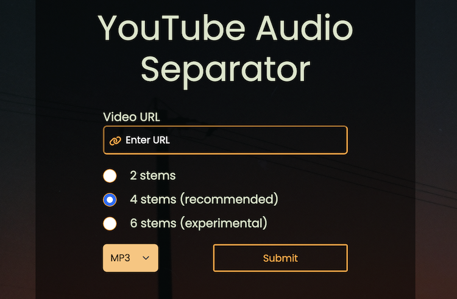

# youtube-ai-stem-separator
## Extract the "stems" (e.g. drums, vocals, bass) from any song on Youtube into separate audio files

## Introduction

This is a Flask app using the [Demucs ML model](https://github.com/facebookresearch/demucs) music source separation models. It also integrates the youtube-dl package to first extract the audio from the YouTube videos before passing them into demucs.

## Screenshot


## Installation

0. Install Python

1. Clone the repository: Open a terminal and clone the repository using the following command:

   ```
   git clone https://github.com/otonomee/youtube-ai-stem-separator.git
   ```

3. Install dependencies: Navigate to the project directory and install the required dependencies 
by running the following command:

   ```
   pip install -r requirements.txt
   ```

4. Run the web app: Start the web app by running the following command:

   ```
   python main.py
   ```
    Or Mac
    ```
    sudo python3 main.py
    ```

5. Access the web app: Open your web browser and go to 
[http://127.0.0.1:5000](http://127.0.0.1:5000:5000) to access the web app.

## Usage

1. Enter the YouTube video URL: On the web app's homepage, enter the URL of the YouTube video you 
want to convert the audio from.

2. Select the number of stems you'd like:
   - 2 stems: vocals and instrumental
   - 4 stems: vocals, drums, bass, other
   - 6 stems: vocals, drums, bass, guitar, piano, other

3. Select desired output format

4. Hit Submit and wait a few minutes. Download prompt will appear when finished :)

